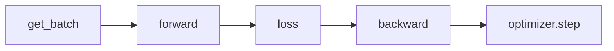
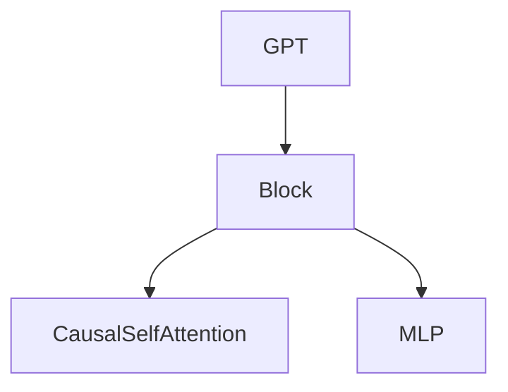

# RouteScale：Transformer 训练性能项目实施教程大纲

> 版本：2026-09-18（全量数据实验路线修订）。每周按约 9 小时规划；时间是估计，达到每阶段的验收条件再进入下一阶段。

## 0. 先明确做什么

**项目问题：**同一个小型 Transformer，从单卡训练到多卡 DDP，再到 MoE，时间和显存花在哪里？测出瓶颈后，Triton 能否改善一个真实热点？

**训练基线：**Fork [karpathy/nanoGPT](https://github.com/karpathy/nanoGPT)，记录所用上游 commit。nanoGPT 作者已将其标记为过时；在本项目里，它是代码简短、便于改动的实验对象，不代表当前生产训练框架。[模型代码](https://github.com/karpathy/nanoGPT/blob/master/model.py) 中 `Block.mlp` 是以后加入 MoE 的位置，[训练代码](https://github.com/karpathy/nanoGPT/blob/master/train.py) 已有 DDP 入口。

**公开数据：**[roneneldan/TinyStories](https://huggingface.co/datasets/roneneldan/TinyStories)。它有 train/validation 两个 split。固定小样本只用于调试；B–E 的正式实验统一使用完整 train/validation split 转换出的本地 token 文件，并记录数据版本与哈希。仓库自带的 Shakespeare 数据只用于环境检查，不用于性能结论。

**个人经历的分工：**信用卡欺诈毕业设计保留为应用建模经历；RouteScale 是一份独立的训练系统作品。TrainScale Lab 的 Profiler、DDP、MoE、LayerNorm 实验可作参考，不直接把已有结果当成你在 RouteScale 中亲自完成的实验。

**完成时应有的证据：**可运行代码、完整 TinyStories 数据清单与哈希、一个固定的正式实验配置、环境和 GPU 拓扑记录、单卡 trace、1/2/4 卡结果、一次四卡全量数据覆盖训练的记录、MoE 路由报告、一个 Triton 正确性与性能对照，以及一篇说明成功与失败的报告。目标是训练系统证据，不以模型生成质量为验收标准。

## 1. 项目边界与总路线

| 阶段 | 建议时间 | 核心问题 | 过关后留下什么 |
|---|---:|---|---|
| A. 建立基线 | 2–3 周 | 小样本能否调通，完整数据能否稳定准备并训练？ | 固定版本、全量数据清单、单卡运行记录 |
| B. Profiler | 2 周 | 一个训练 step 的时间用在哪里？ | trace、瓶颈解释、一次同条件复测 |
| C. DDP | 3–4 周 | 1/2/4 卡为何这样扩展？完整语料怎样覆盖？ | 正确性检查、strong/weak scaling 表、全量覆盖记录 |
| D. 单卡 MoE | 3 周 | 路由、负载和稀疏计算带来什么？ | Top-1 MoE、路由指标、dense 对照 |
| E. Triton | 2–3 周 | 一个 GPU 算子是否值得替换？ | 前反向检查、微基准、完整训练对照 |
| F. Expert Parallel | 完成 D 后可选，约 2–3 周 | 分布专家的通信代价是什么？ | 两卡 All-to-All 正确性及 trace |
| G. 求职材料 | 1 周 | 陌生人能否在 5 分钟内看懂贡献？ | README、图表、演示和简历要点 |

前五阶段约需 12–15 周，完整数据准备和四卡持续训练可能增加时间与租卡成本。先用短基准估算一次全量遍历所需时间，再安排持续运行；如果代码理解、环境排障需要更多时间，延长阶段，不压缩正确性检查。F 是进阶实验，不阻塞 G。

### 最小文件增量

先保留 nanoGPT 原有的 `train.py`、`model.py`、`bench.py`。需要时再新增：

- `data/tinystories/prepare.py`：同一脚本支持调试子集和完整 split，流式转换为 nanoGPT 所需的 `train.bin`、`val.bin`，输出可提交的数据清单。
- `config/train_tinystories_debug.py` 与 `config/train_tinystories.py`：分别用于小样本排障和冻结后的全量数据实验。
- `moe.py`：单卡 Top-1 MoE；到阶段 D 才建立。
- `results/README.md`：记录每次正式实验的配置、环境、原始值和结论。
- Triton 代码只有进入阶段 E 且确定目标算子时才建立。

不要先重写训练框架，也不要复制 TrainScale Lab 的整个模块树。

### 数据规模与实验含义

“使用完整数据集”有两个层次，报告中必须分开：

1. **正式实验数据源：**完整 train 与 validation split 都已转换成本地 token 文件；B–E 的正式运行使用这些文件，不用调试子集。固定数据版本、tokenizer、拼接方式和文件哈希。
2. **训练覆盖量：**短时间的 Profiler、scaling 和算子 A/B 只会读取完整文件中的一部分 token；报告读取了多少 token，不能称为“遍历完整语料”。C 阶段另做一次四卡持续训练，使每个可用训练窗口都被处理一次，并记录接近完整的一轮 token 覆盖、耗时和验证 loss。

大文件不会自动使 GPU 算子更忙；每步的模型形状、序列长度、batch 和精度仍是性能关键变量。因此先在目标四卡机器上确定能稳定运行、又有足够计算量的模型配置，再冻结它。正式的 1/2/4 卡吞吐只在同一台四卡机器上比较；本地 8 GiB 单卡结果用于学习与排障，不与租用机器的卡数结果混算。

## A. 建立一个你能解释的训练基线

### A1. 固定代码和环境

1. 在 GitHub 上 Fork nanoGPT，克隆到单独的 `RouteScale` 工作目录；保留原项目的 MIT LICENSE 和出处。
2. 保存上游 commit、Python/PyTorch/CUDA/驱动版本。使用 Linux 或 WSL2 的 CUDA 环境；先确认 `torch.cuda.is_available()`、`torch.cuda.device_count()`，再确认实际 GPU 名称。
3. 首次运行设 `compile=False`。`torch.compile` 的首次编译时间会干扰入门时的计时；以后把它作为单独变量比较。
4. 读懂 `model.py` 的 `CausalSelfAttention → MLP → Block → GPT`，以及 `train.py` 的 `get_batch → forward → loss → backward → optimizer.step`。画一张只含这些节点的流程图。

**当前进度（2026-09-18，A1 功能检查已完成；个人 Fork 与自主复述仍待核实）：**

- [x] 已克隆 nanoGPT，保留原 MIT LICENSE；上游 commit 为 `3adf61e154c3fe3fca428ad6bc3818b27a3b8291`，记录在根目录 `UPSTREAM_COMMIT.txt`。当前 Git remote 只有 `upstream`；个人 GitHub Fork / `origin` 尚未核实。
- [x] 已建立 RouteScale 独立 `.venv`，依赖写在 `pyproject.toml`，解析结果写在 `uv.lock`。环境：WSL2 Linux，Python 3.11.16，PyTorch 2.12.1+cu129，PyTorch CUDA 12.9，NVIDIA 驱动 610.88；`torch.cuda.is_available() == True`，`torch.cuda.device_count() == 1`；GPU 为 NVIDIA GeForce RTX 5060 Laptop GPU，显存 8151 MiB。CUDA 版本指 PyTorch 所用运行时版本。
- [x] 首次训练显式设置 `compile=False`。Shakespeare character 数据已准备：train 1,003,854 tokens、val 111,540 tokens。用 `batch_size=4`、`block_size=64`、2 层、2 头、宽度 128、`max_iters=2` 的 CUDA 小模型短跑完成训练和验证，并保存 `out-smoke/ckpt.pt`。这是环境冒烟检查，不是正式性能结果，也不代替下面建议的几十步短跑。
- [x] 已完成 `model.py` 与 `train.py` 主路径的概念梳理，并画出下面的流程图。已能区分 token ID、向量、logits、loss、梯度和参数更新；这里记录为“主路径初步理解”。Attention 内核实现和 AdamW 逐行推导不是 A1 的过关条件；后续只按 Profiler、DDP、MoE 或 Triton 实验的实际需要深入。
- [x] 已补做 Shakespeare 单卡短跑：同一小模型，`compile=False`、`gradient_accumulation_steps=1`、`eval_iters=10`、`max_iters=30`。nanoGPT 的终止条件是 `iter_num > max_iters`，实际执行 iter 0–30，共 31 次更新。训练过程无 NaN/OOM；验证 loss 从 step 0 的 4.2059 到 step 30 的 3.4921；保存 `out-a1-shakespeare/ckpt.pt`。这是功能验证，不是吞吐性能结论。
- [x] A2 本地验收已完成：TinyStories 调试与完整数据、正式模型候选、峰值显存、精确 300-step 稳定运行和 checkpoint 恢复均已验证。到四卡机器后仍需在 B–E 正式实验前重新核对硬件适配并冻结最终配置。

**主路径流程图（只画 A1 要求的节点）：**



`forward` 内部的模块调用关系如下。每个 `Block` 先执行 `CausalSelfAttention`，再执行 `MLP`；`GPT` 中的多个 Block 各有自己的参数。



**学习中问过、容易混淆的点（已讨论，复习时重点检查）：**

| 问题 | 当前理解 |
|---|---|
| `batch_size`、`block_size`、`Block` | `batch_size` 是每次前反向的片段数；`block_size` 是每段的 token 数；`Block` 是模型中的 Transformer 模块。短跑时 `X`、`Y` 都是 `(4, 64)`。 |
| 数据 block 与 Transformer Block | 数据 block 是从 token 文件截出的一段输入，例如 512 个 token；Transformer Block 是模型内部重复的加工层，每层依次做 Attention 和 MLP。`block_size=512` 决定每段输入长度，`n_layer=8` 表示同一批输入连续经过 8 个参数不同的 Transformer Block。 |
| `X`、`Y` 为什么错开一位 | `get_batch` 用同一起点 `i`，分别取 `data[i:i+block_size]` 和 `data[i+1:i+1+block_size]`；例如 `X=ABCD`、`Y=BCDE`。 |
| 一次前向是不是只预测一个 token | 训练时对 `X` 的每个位置都预测下一个 token；短跑配置一次前向有 `4 × 64` 个预测位置，汇总为一个 loss。 |
| 是否会完整遍历数据 | 当前代码随机且有放回地取起点，由 `max_iters` 控制更新次数；不会保证每个片段都被取到。 |
| 梯度累积 | 每个 micro-batch 的 loss 除以累积步数后调用 `backward()`；累积完成才调用一次 `optimizer.step()`。 |
| token 如何变成 128 维 | `wte` 是可训练的 token 向量表：按 token ID 查一行 128 维向量，再加按**位置编号**查出的 128 维位置向量。128 是维度，不是层数；向量随机初始化，训练中更新。 |
| 两个 Block 和 MLP 的作用 | `n_layer=2` 表示两个各自有参数的 Block；每个 Block 都含 Attention 和 MLP。Attention 汇集当前及之前位置的信息；MLP 在每个位置独立地做 `128 → 512 → GELU → 128` 变换。 |
| logits、loss、梯度、模型参数 | `logits` 是每个位置对词表的预测分数，和 `Y` 比较得到 loss；`backward()` 计算模型参数的梯度，`optimizer.step()` 更新模型参数，随后清空梯度。输入 token ID 不会被更新。 |

后续检验：不看本表，自己用 `X=ABCD`、`Y=BCDE` 讲清一次更新，并指出 [`model.py`](../model.py) 与 [`train.py`](../train.py) 中对应的代码。

**环境检查示例：**

```bash
uv run python -c "import torch; print(torch.__version__, torch.cuda.is_available(), torch.cuda.device_count(), torch.cuda.is_bf16_supported())"
nvidia-smi -L
```

按 nanoGPT README 先准备自带数据，再短跑几十步。目标是证明前向、反向、保存和读取训练数据可用；这不是正式性能结果。

```bash
uv run python data/shakespeare_char/prepare.py
uv run python train.py config/train_shakespeare_char.py --device=cuda --compile=False --batch_size=4 --block_size=64 --n_layer=2 --n_head=2 --n_embd=128 --max_iters=30 --eval_interval=30 --eval_iters=10 --log_interval=10 --out_dir=out-a1-shakespeare --always_save_checkpoint=True
```

### A2. 准备 TinyStories

**当前进度（2026-09-20，A2 本地验收通过）：**

- [x] 新增 `data/tinystories/prepare.py`，固定数据 revision、GPT-2 tokenizer 和故事分隔 token；采用流式读取、分批增量写入、临时文件完成后原子改名，并输出故事数、token 数、最大 token ID、字节数和 SHA256。
- [x] 固定前 10,000 条 train 与前 1,000 条 validation。生成结果位于 `data/tinystories_debug/`：train 为 2,162,078 tokens（4,324,156 bytes，SHA256 `5f76f6d0018cc41bcec8e445c53f6586b4f340ec2736812d3b77fe40066c8223`）；validation 为 194,559 tokens（389,118 bytes，SHA256 `5f2d5a7972a450f23d4fcb6a3f94dfc4c40ed5cf5a0ce616b895ae5308f4fd85`）。独立复算后，大小和哈希均与 `manifest.json` 一致；EOT 数分别为 10,000 和 1,000。
- [x] 新增 `config/train_tinystories_debug.py`。使用 4 层、4 头、宽度 256、`block_size=256`、`batch_size=16`、BF16、`compile=False`，约 16.01M 参数，每次更新 4,096 tokens。在调试数据上运行至 step 100，无 NaN/OOM；validation loss 从 10.8273 降至 4.7811，checkpoint 保存于 `out-tinystories-debug/ckpt.pt`。该配置与结果只证明数据和训练链路可用，不进入正式性能表。
- [x] 已转换完整 split：train 共 2,119,719 篇、473,992,236 tokens、947,984,472 bytes，SHA256 `66c5c49a38ebcab576854f2f58fad55e06b2bb29ecbc34fa421910e4beb37500`；validation 共 21,990 篇、4,765,918 tokens、9,531,836 bytes，SHA256 `f0d47c000fdf2f7fbae1159832002b079a338cfde9ce4c5f65413da68386f5be`。独立分块复算确认两个文件的大小均为 `token_count × 2`，且哈希与清单一致。
- [x] 已在 `tinystories_full` 上运行小模型至 step 300：每次更新 4,096 tokens，基于每次 20 个随机 validation batch 的 loss 估计从 10.8290 降至 4.4494，无 NaN/OOM；step 100/200/300 均成功保存 checkpoint，最终文件为 `out-tinystories-full-smoke/ckpt.pt`。普通训练 iter 约 42–45 ms；eval/checkpoint 所在 iter 约 1.07–1.14 s，不能与纯训练 iter 混合计时。该运行验证完整文件和训练链路，不是正式吞吐基准，也不是完整 validation 遍历。
- [x] 日志中的 `mfu≈2.5%–2.9%` 暂不作为 GPU 利用率结论：nanoGPT 的 `estimate_mfu()` 固定用 A100 BF16 的 312 TFLOPS 作分母，而当前设备是 RTX 5060 Laptop GPU。后续性能阶段需采用当前 GPU 的正确硬件基准，并结合 Profiler 与 tokens/s。
- [x] 已修正更新次数边界：`iter_num` 现在表示已完成的 optimizer update 数；循环在最终 step 先完成 evaluation/checkpoint，再以 `iter_num >= max_iters` 结束。`max_iters=300` 因此准确对应 300 次更新，checkpoint 的 `iter_num` 也为 300。
- [x] 新增本地候选配置 `config/train_tinystories.py`：8 个 Transformer Block、8 heads、宽度 512、`block_size=512`、BF16、`compile=False`、累积 4 次，共 50.91M 参数。micro-batch 4/6/8 的短跑峰值 allocated/reserved 分别为 2426/2772、3158/3968、3899/5148 MiB；选择 batch 8，每次更新 16,384 tokens，reserved 峰值约占本机 8151 MiB 的 63%。
- [x] 候选配置在完整 TinyStories 上准确运行 300 次更新，无 NaN/OOM。基于 20 个随机 validation batch 的 loss 估计从 10.9094 降至 step 100 的 4.0805、step 200 的 3.7706、step 300 的 3.5545；峰值显存 3899.2 MiB allocated、5148.0 MiB reserved。最终 checkpoint 为 `out-tinystories/ckpt.pt`（585.6 MiB，`iter_num=300`），已成功恢复并继续执行两次更新。详细记录见 `results/README.md`。
- [ ] 在后续四卡目标机器上重新核对模型、每卡 micro-batch 和显存，随后冻结 B–E 使用的最终配置；这属于正式性能环境准备，不撤销本地 A2 验收。

1. 固定 [TinyStories](https://huggingface.co/datasets/roneneldan/TinyStories) 的仓库 commit，而非每次读取移动的 `main`。当前核对的版本为 `f54c09fd23315a6f9c86f9dc80f725de7d8f9c64`；脚本把 revision 做成参数，实际采用的值写进数据清单。直接使用已有的 `train`、`validation` split，不重新混合后划分。
2. **先调试：**流式读取固定的前 10,000 条 train 和前 1,000 条 validation，输出到 `data/tinystories_debug/`。用这份小数据检查文本字段、tokenizer、`uint16` 写入、`get_batch`、loss 和 checkpoint。它只承担排障任务，不能进入正式性能表。
3. **再准备完整数据：**同一个 `prepare.py` 不设行数限制，遍历完整 train 与 validation，逐条编码并增量写到 `data/tinystories_full/train.bin`、`val.bin`。不要把全部原始文本或 token 一次放进内存；下载中断应能安全重跑，只有两个文件都完成并校验后才标记为正式版本。完整文件需复制到后续四卡机器，并在两边核对哈希。[Hugging Face streaming 说明](https://huggingface.co/docs/datasets/en/stream)
4. 固定一个 tokenizer（例如 nanoGPT 常用的 GPT-2 BPE）和每篇故事之间的分隔 token；调试与全量数据采用相同规则。写入前确认最大 token ID 小于 65536，写入后检查文件非空、token 数大于 `block_size + 1`，且 train/validation 没有混写。数据清单记录数据源 commit、实际读取的故事数、tokenizer 名称与版本、分隔规则、token 数、文件字节数和 SHA256。Git 只保留脚本与清单，不提交原始文本或 `.bin`。
5. 先用 `config/train_tinystories_debug.py` 在本地排障；再用 `config/train_tinystories.py` 读取 `tinystories_full` 完成数百步单卡稳定性检查。模型以约 GPT-2 small 为候选，在目标四卡服务器上按显存与 step 时间确定正式形状；本地 8 GiB GPU 可以用更小配置做功能检查。正式模型的层数、宽度、序列长度、精度、每卡 micro-batch 和随机种子在 B–E 对照前冻结。

**验收：**完整 train/validation 的本地 token 文件和数据清单存在，故事数与数据集元信息可核对，两个文件的哈希在本机和四卡机器一致；全量文件上的单卡数百步运行无 NaN/OOM，能保存 checkpoint，loss 有合理变化，验证 loss 能计算。记录参数量、每次更新 token 数和峰值显存。这里完成的是全量数据**准备**与稳定训练试运行，不宣称已遍历所有训练 token。

## B. PyTorch Profiler：先解释，再改进

### B1. 先建立没有 Profiler 的速度基线

1. 正式运行读取 A2 的 `tinystories_full`，先核对 SHA256；在将用于 C 的同一台四卡机器上选择其中一张卡测单卡基线。本地 RTX 5060 的练习记录另存，不与这台机器的扩展效率比较。固定模型、采样顺序、batch、序列长度、精度和 `compile` 状态；计时窗口内不下载数据、不验证、不写 checkpoint。
2. 在正式计时前实现单卡确定性窗口取样，固定窗口顺序；C1 再扩展到按 rank 分配。先预热至少 20 次更新，再测足以稳定计时的一段训练（先以至少 100 次更新为目标），至少重复 3 次；记录每次原始时间和中位数。如果启动、编译、数据预取尚未稳定，就延长预热。CUDA 异步执行会影响 CPU 计时，要在计时边界同步 GPU，或用合适的 CUDA event/统一的训练计时方式。
3. 主指标是 **tokens/s**，另记 step 时间、峰值显存、loss，以及本次从全量文件实际读了多少 token。写清楚 tokens/s 是单卡还是全机、是否包含取数据。这段短基准不等于一次全量遍历。

### B2. 采集 trace

1. 参考 [PyTorch Profiler 官方教程](https://docs.pytorch.org/tutorials/recipes/recipes/profiler_recipe.html)，在同一完整数据文件与正式模型上，只对少量 step 开启 CPU/CUDA trace，例如 wait 2、warmup 2、active 10；Profiler 会带来额外开销，不把 trace 运行的速度当正式吞吐。
2. 用 `record_function` 给 `get_batch`、forward、backward、optimizer step 标记范围。分别看 CPU 提交、GPU kernel、数据拷贝、等待和显存。
3. 从时间线选一个**有证据**的瓶颈。候选改动可能是数据准备、batch、precision 或同步点；不要因为某个技术热门就强行使用它。
4. 只改一个变量，回到 B1 的无 Profiler 计时方式复测；检查 loss 不出现异常。报告“哪里变快/变慢、整体改变多少、条件是什么”。

**验收：**你能打开 trace 指出瓶颈区段，并能解释为什么 `key_averages` 的父子事件时间不能直接相加。同级目录 `TrainScale_Lab/01_pytorch_training/experiments/05_profiler.md` 可用来练习读图。

## C. DDP：让同一任务在 1/2/4 卡上运行

### C1. 正确理解原脚本

1. 读 nanoGPT 的 `RANK`、`LOCAL_RANK`、`WORLD_SIZE`、进程组、DDP 包装和梯度累积代码。画出“一张卡对应一个进程；每卡有完整模型副本；反向时同步梯度”。[PyTorch DDP 官方教程](https://docs.pytorch.org/tutorials/intermediate/ddp_tutorial.html)
2. 写下公式：`每次 optimizer 更新的全局 token 数 = 每卡 micro-batch × 序列长度 × 每卡累积步数 × GPU 数`。nanoGPT 会随 GPU 数改变每卡累积步数；正式计时前核对实际值。
3. 为正式数据实验补一个可复现的取样计划：把 `tinystories_full/train.bin` 划为可用的固定长度 token 窗口，规定窗口顺序，再按 rank 分配不同窗口。原版 `get_batch` 的随机起点有放回，不能证明全量覆盖；不同 rank 的随机种子也不等于严格无重叠分片。strong scaling 的 1/2/4 卡实验应消费相同的**全局窗口序列**，再分给不同 rank；记录重复、丢弃与尾部处理规则。先用小文件检查每个窗口的覆盖次数。
4. 用固定输入做一个最小梯度检查：单卡大 batch 与两卡分 batch 的一次更新应在合理浮点误差内接近。不要要求两次随机训练的 loss 曲线逐步完全一致。

**先跑通的命令形态**（正式配置与全量 token 文件在 A2 完成后才能运行；从仓库根目录执行）：

```bash
uv run torchrun --standalone --nproc_per_node=1 train.py config/train_tinystories.py --compile=False
uv run torchrun --standalone --nproc_per_node=2 train.py config/train_tinystories.py --compile=False
uv run torchrun --standalone --nproc_per_node=4 train.py config/train_tinystories.py --compile=False
```

例如把配置中的 `gradient_accumulation_steps` 设为 8：nanoGPT 在 1/2/4 卡时分别让每 rank 累积 8/4/2 步，因此在 `batch_size`、`block_size` 固定时全局 token 数相同。做 weak scaling 时，若想让每 rank 始终累积 8 步，1/2/4 卡分别把配置值设为 8/16/32。先在日志中核对实际 token 数，再比较速度。

### C2. 两种 scaling 要分开测

在一台安装了 4 张**同型号** GPU 的机器上分别运行 1/2/4 卡。先核对正式 `train.bin`、`val.bin` 的哈希，保存 `nvidia-smi -L` 和 `nvidia-smi topo -m`，确认它们在同一台服务器上，并记录卡间连接。拓扑会影响 NCCL 通信。[NVIDIA 拓扑命令说明](https://docs.nvidia.com/deploy/nvidia-smi/)

- **Strong scaling：**每次更新的全局 token 数固定。卡数增加时，每卡工作减少；看完成同一工作量要多久。
- **Weak scaling：**每卡 token 数固定。卡数增加时全局工作增加；看全机吞吐是否随卡数增长。

每种配置都从同一初始模型状态开始、在完整数据文件上使用固定的窗口序列；预热与计时范围遵循 B1，各至少重复 3 次，取中位数。记录最慢 rank 的 step 时间、全机 tokens/s、各卡峰值显存、NCCL/AllReduce trace、GPU 拓扑和实际处理的 token 数。`speedup = N 卡吞吐 / 1 卡吞吐`；`efficiency = speedup / N`。把模型规模、batch、序列长度和精度写在同一张表旁。性能短跑只测扩展性，不冒充完成全量训练。

**验收：**能解释“为什么 4 卡未必 4 倍快”，区分计算不足、数据准备、同步等待和卡间连接。先用 2 卡排障，再开 4 卡；出现 rank 卡死先查错误和进程状态，不反复盲跑。

### C3. 四卡持续训练：让完整训练数据真正被处理

1. 用 C1 的确定性窗口分配，在完整 `tinystories_full/train.bin` 上跑一轮覆盖训练；每个可用窗口至少处理一次。先根据完整 token 数和 B1/C2 的实测吞吐估算 step 数、时长、存储与费用，确认 checkpoint 和中断恢复能工作后再启动。
2. 运行中定期保存 checkpoint、已处理窗口数和全机累计 token 数；计入因最后一个不满的 batch 而补齐的重复窗口，并报告无法构成完整窗口的尾部 token 数。周期性用固定 validation 样本检查 loss，结束时对完整 validation 文件做一次评估。
3. 报告完整数据覆盖率、总运行时间、各卡平均与峰值显存、初末验证 loss、checkpoint 路径。持续训练与 C2 的短基准分别记录，不把包含验证和保存的墙钟时间当作纯训练吞吐。

**验收：**有一次从头到尾处理完整 TinyStories train token 文件中所有可用窗口的四卡记录；如外部机器中断，恢复后仍能核对哪些窗口已处理，不把部分覆盖误写成全量完成。

## D. 单卡 MoE：只替换 Transformer 的一部分 MLP

### D1. 最小 Top-1 实现

1. 保留 attention、embedding 和原训练任务。在 `model.py` 的一个 `Block.mlp` 位置接入 `moe.py`；先让其余 block 保持 dense。
2. Router 为每个 token 计算 expert 分数；Top-1 选择一个 expert；按 expert 收集 token，计算后放回原位置。先用 2–4 个 expert，循环实现足以帮助理解，暂不做复杂的高性能 dispatch。
3. 先不加入 capacity 和负载均衡损失。检查每个输入 token 都被处理一次、输出顺序正确、loss 有限、router 和被选中的 expert 有梯度。
4. `num_experts=1` 时与相同权重的普通 MLP 做输出/梯度对照。再加入 `expert_counts`、最大/平均负载、负载离散程度；最后才做 capacity、token drop 与 balance loss 的单变量实验。
5. 比较 dense 与 MoE 时同时报告**总参数**和**每 token 激活参数**，避免用总参数不同的模型直接宣称“MoE 更高效”。
6. 小样本仅用于路由和梯度正确性。正式 dense/MoE 速度、显存和负载对照在 `tinystories_full` 上运行，使用目标机器的同一张 GPU、相同 tokenizer/窗口顺序/序列长度/精度，并报告实际覆盖的 token 数；从可比的初始状态开始，至少重复 3 次计时。另做较长的稳定性运行观察 expert 负载和验证 loss，不用少量手工 token 的结果代表大数据表现。

**验收：**你能用纸笔给 6 个 token 手算路由，解释为什么 MoE 总参数增加而每个 token 只激活少数 expert；有基于完整 TinyStories 数据文件的负载/吞吐/显存表与覆盖量记录。同级目录 `TrainScale_Lab/extensions/01_moe/README.md` 可作概念和正确性参考。

### D2. DDP 与 Expert Parallel 的区别

把单卡 MoE 包上 DDP 时，每张卡仍复制全部 expert。只有把不同 expert 放在不同 rank，并用 All-to-All 发还 token，才进入 **Expert Parallel**。因此不要把“四卡 DDP MoE”写成“已实现 Expert Parallel”。

若继续做 F：先两卡，先验证路由、输出和梯度，再测通信时间。现有 TrainScale Lab 仅有 CPU/Gloo 的 EP 正确性记录，可在新项目中做 GPU/NCCL 增量。通信可能使小模型更慢，负结果也可成为有效结论。

## E. Triton：一个算子，先训练正确，再看整体收益

1. 先跟 [Triton 官方教程](https://triton-lang.org/main/getting-started/tutorials/) 学 vector add、fused softmax 的 block、mask、stride 和编译/预热概念；不把教程算子本身当项目成果。
2. 回看 B 和 D 的 trace，确认一个值得研究的热点。首选候选是 nanoGPT 中实际使用的 LayerNorm：同级目录 `TrainScale_Lab/02_gpu_kernels/benchmarks/run_layer_norm_training.py` 已有 LayerNorm 前反向对照，可以先复现，再考虑适配 RouteScale 的 shape、dtype 和 bias。
3. 分别检查 forward、输入梯度、权重梯度和 bias 梯度；覆盖实际用到的 shape/dtype。若进入主模型，用一个最小的 autograd 包装把自定义 forward/backward 接进训练。**只有 forward 快但 backward 不正确，不能替换训练算子。**
4. 微基准记录编译时间、预热后延迟和误差；对照原生 PyTorch，也单独对照 `torch.compile`。微基准的 shape/dtype 必须来自正式模型与完整数据实验的实际运行，不从玩具形状推断收益。
5. 在目标四卡机器上，从相同 checkpoint 和同一组 `tinystories_full` 窗口开始，分别运行原生算子与 Triton 版本。先做至少 3 次固定训练窗口的无 Profiler 对照，比较 tokens/s、step 时间、显存和 loss；每次都记录处理了多少 token。正确且值得继续的候选，再各做一次完整数据覆盖运行，对照纯训练时间和最终 validation loss；原生版本可以复用 C3 的记录，但必须保证模型、窗口顺序、机器和计时口径一致。
6. 如果 trace 表明目标算子并非显著瓶颈，或短窗口对照没有整体收益，就保留正确性与负结果，不为展示技术而强行跑昂贵的全量 A/B；在报告中明确正式训练对照覆盖了多少数据。

**验收：**能回答“算子快了多少、完整数据上的训练变了多少、为什么两者不同”，并区分固定窗口对照与完整数据覆盖运行。

## F. 结果、公开仓库与面试表达

每次正式实验保留以下最小记录：

| 实验与运行类型 | 代码 commit | 数据 revision 与 bin 哈希 | GPU/拓扑 | 模型与精度 | global tokens/update | 实际 token 覆盖量 | step 时间中位数 | 全机 tokens/s | 峰值显存 | loss/正确性 | 原始结果路径 |
|---|---|---|---|---|---:|---:|---:|---:|---:|---|---|

README 顶部用三句话说清：训练任务、你亲自改变了什么、实测结论和边界。后面提供从环境检查、数据准备到单卡/多卡运行的最短命令。清楚标注 nanoGPT 上游代码、你自己的修改、AI 辅助的范围；面试时只主张你能独立复现并解释的部分。不要提交原始数据、大型 trace、训练 checkpoint 或租卡凭据。

每张结果表明确标成“调试子集”“完整数据上的固定窗口基准”或“完整数据覆盖训练”。只有最后一类可以写“训练已覆盖完整 train split”；数据文件本身完整，不等于运行已经看完全部故事。

完成项目时，自己不看文档回答以下五问：

1. Profiler 时间线中哪段最耗时？修改后完整训练是否变快？
2. DDP 的 rank、global batch、梯度同步分别在代码哪里发生？
3. 1/2/4 卡 strong 与 weak scaling 的结论为何不同？
4. DDP MoE 和 Expert Parallel 究竟差在哪里？负载不均会造成什么？
5. Triton 算子通过了哪些前反向检查？单算子和整段训练的收益各是多少？

## 从今天开始的第一周

1. **约 2 小时：**Fork nanoGPT，记录 commit、LICENSE、环境和 GPU；只读 `model.py` 与 `train.py` 的主路径。
2. **约 2 小时：**运行自带 Shakespeare 单卡短跑，确认能完成若干训练 step；排除环境问题。
3. **约 3 小时：**建立 TinyStories 数据准备脚本和最小训练配置，先用固定小样本；完整 split 的编码与校验安排在 A2 后续，不要求第一周完成。
4. **约 2 小时：**保存第一次单卡记录：模型参数量、token 数、step 时间、显存和 loss；写下三个尚不确定的问题。

第一周结束的唯一硬门槛：**你能独立说清数据怎样进入模型、一次参数更新做了什么，并能再次运行得到同类结果。**达到这一步后继续 A2 的完整数据准备；通过 A2 验收后才开始 B 的正式 Profiler。
